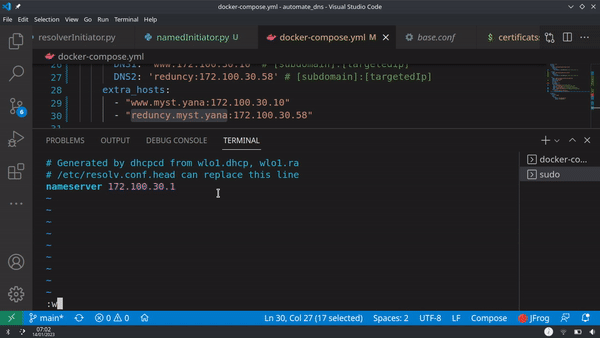
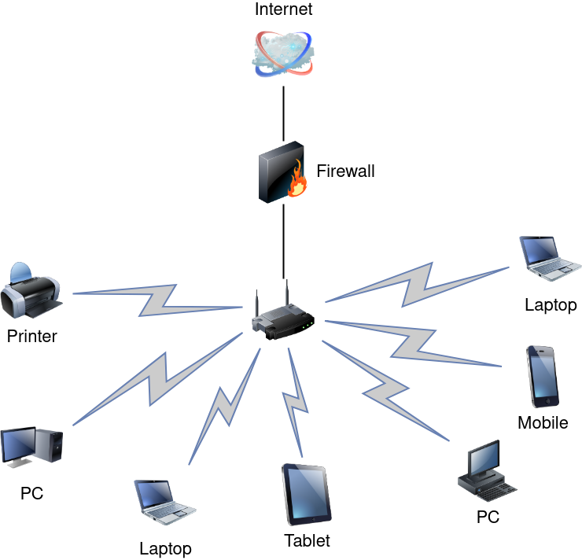

# Automated bind DNS

<td></td>

## Intro

Once the container is up and running, you can establish a connection to your machine through DNS by making modifications to the '/etc/resolv.conf' file. It's essential to specify the "nameserver" field with the IP address of your DNS server, ensuring that all queries are routed through your DNS.

This innovative concept enables DNS-based communication even within a private network, facilitating communication between machines in your cluster via DNS.

This approach allows you to fully leverage the capabilities of your DNS.

nameserver `dnsip` # /etc/resolv.conf

<br />
 <table>
  <tr>
    <th>How to use it</th>
    <th>How it's work</th>
  </tr>
  <tr>
    <td></td>
    <td></td>
  </tr>
  <tr>
    <td>To connect to your DNS, make sure to modify '/etc/resolv.conf' on your machine.</td>
    <td>Assign a DNS name to each container that has been referenced. This will enable connected users to easily address a container using its DNS name.</td>
  </tr>
</table> 
<br />

## Docker Parameter 

Getting started

`IP`: server dns ip

`CIDR`: ip address range

`DNS_BASE`: dns server name base

`DNS[:N]`: subdomain dns server bound definition, where N is an incremental number of subdomain

`ETC`: default '/etc' etc path

`BIND_DIR`: default '/etc/bind' bind path

## Example

```yaml
version: '3.9'
services:
  server0:
    image: robertshand/python-hello-world
    networks:
      dnsserver:
        ipv4_address: 172.100.30.10 # hello world static ip

  server1:
    image: robertshand/python-hello-world
    networks:
      dnsserver:
        ipv4_address: 172.100.30.58 # hello world static ip

  dns:
    image: registry.gitlab.com/maissacrement/dns:latest
    domainname: myst.yana
    network_mode: host
    hostname: dns
    ipc: host
    privileged: true
    environment:
      IP: '172.100.30.1' # ip of dns server
      CIDR: '172.100.30.0/24' # ip address auth range
      DNS_BASE: 'myst.yana' # dns server base name
      DNS1: 'www:172.100.30.10' # [subdomainPrefix]:[targetedIp]
      DNS2: 'reduncy:172.100.30.58' # [subdomainPrefix]:[targetedIp]
    extra_hosts:
      - "www.myst.yana:172.100.30.10" # container server0
      - "reduncy.myst.yana:172.100.30.58" # container server1

networks:
  dnsserver:
    driver: bridge
    ipam:
      config:
        - subnet: 172.100.30.0/24
          gateway: 172.100.30.1
```

## FIX: 1.0.1

* MOVE RESOLV TO EXTRA_HOST
* MAKE SURE AVAILABILITY OF BIND AND NGINX